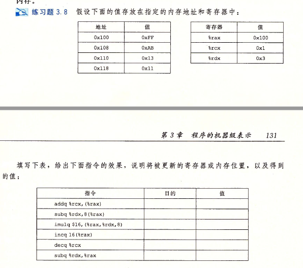

### 程序的机器级表示 练习题


####    3.6


**答：**

`leaq 6(%rax),%rdx`（图示有误）表示将` %ax +6` 赋值给`%rdx`，结果6+x

`leaq (%rax,%rcx),%rdx`，结果x+y

`leaq (%rax,%rcx,4) %rdx`，x+4y

`leaq 7(%rax,%rax,8) %rdx`,9x+7

`leaq 0xA(,%rcx,4) %rdx`,10+4y

`leaq 9(%rax,%rcx,2),%rdx ` , 9+x+2y

#### 3.7


```
rax=x+4x=5x;
rax=rax+2rsi=5x+2y;
rax=rax+8rdx=5x+2y+8z
```

因此，缺失的C表达式是

```c
long t = 5*x+2*y+8*z;
```

#### 3.8



`addq %rcx,(%rax)`表示将内存`(%rax)`处的值减去`%rcx`，目的 0x100，值0xFF+0x1=0x100

`subq rdx,8(rax)`,target is 0x100+8=0x108, value is 0xAB-0x3=0xA8

`imulq $16,(rax,rdx,8)`,target is `rax+8*rdx=0x100+8*0x3=0x118`,value is 16* 0x11=0x10*0x11=0x110

`incq 16(rax)`,target is `rax+16=0x110`,value is 0x13+1=0x14

`decq rcx` target is `%rcx`,value is 0x1-1=0x0

`subq rdx,rax`,target is `%rax`,value is 0x100-0x3=0xFD

#### 3.9


```ASM
shift_ledt44_rightn:
	movq %rdi,%rax ; rax<-x
	salq $4 , %rax ;x<<4
	movl %esi,%ecx ;取n低32位存入rcx低32位
	sarq %cl,%rax  ;64位数据移位量是cl的低6位                              
```

#### 3.10


```asm
orq rsi,rdi -> rdi=rsi | rdi -> x=x | y
sarq 3,rdi ->  rdi=rdi>>3 -> x=x>>3
notq rdi -> rdi=~rdi -> x=~x
movq rdx,rax -> rax = z
subq rdi,rax -> rax=rax-x
```

转换为C语言

```c
long t1 = x|y;
long t2 = t1>>3;
long t3 = ~t2;
long t4 = z-t3;
```

#### 3.11


A: 用于将寄存器`rdx`清零

B：`mov $0, %rax`

C: `xorq`版本代码需要3字节，而`movq`版本需要7字节，

#### 3.12


64位汇编除法中64位被除数应该存在`%rax`中,无符号除法应该将`%rdx`设置为全0

```asm
; x in rdi,y in rsi , qp in rdx, rp in rcx
uremdiv:
	movq %rdx,%r8 ; copy qp value to r8
	movq %rdi,%rax ; copy x value to rax 作为被除数
	movl $0,%edx ; %rdx?? 
	divq %rsi ; divided by y
	movq %rax,(%r8) ; 商在rax中,复制到内存*qp中
    movq %rdx, (%rcx); 余数在rdx中,复制余数
	ret
```

#### 3.13


**汇编代码不会记录程序值的类型**

##### A：

比较指令`cmp`具有后缀`l`，（对set指令后缀意义不同于此）

| 后缀 | 表示字节数 |
| ---- | ---------- |
| b    | 1          |
| w    | 2          |
| l    | 4          |
| q    | 8          |

表示则是两个4字节32位数据的比较，比较是`setl`表示小于时设置 ，将数据视为补码

推断`data_t`是`int`

##### B:

`cmpw`,w reflects they are 2bytes, 16bit

`setge` means  setting when condition is  `>=`, also two's complement 

`data_t `  is  `short`

##### C:

`cmpb` b reflects they are byte ,8 bit

`setbe` means setting when `<=`  and  `unsigned`

`data_t`  is  `unsigned char`

##### D:

`cmpq` q ,so they are 8bytes 64bits

`setne`  not equal  can be `signed` 、`unsigned`、and `point parameter` 

`data_t`可以是`long int`、 `unsigned long int`、`某种形式的指针 (xxx)*`

#### 3.15


##### A:

此处跳转指令的目标偏移量用单字节补码表示0x02，下一条指令地址4003fc+偏移量0x02=目标0x4003FE

##### B:

0x400431+0xf4=0x400431-0xC (12)=0x400425

##### C：

pop 地址 p 

p+0x02=0x400547，p=0x400545

ja指令占据两个字节, ja指令地址是 0x400543

##### D:

目标的偏移量由4字节表示，小端法，实际偏移量是0xffffff73=-(0x8C+1)=-141

4005ed-0x8D=400560

`jmpq 400560`

#### 3.16


##### A:

```c
void cond(long a,long *p){
	if(p==0)//可以判断就直接跳过，短路效应
        goto done;
    if(*p>=a)
        goto done;
    *p=a;
    done:
    	return;
}
```

##### B:

题干中的C代码只有一个`if`是因为表达式有`&&`，在汇编代码中第一个条件分支用于测试`&&`左边的条件,第二个分支用于测试第二个条件

#### 3.17


##### A：

```c
long lt_cnt=0;
long ge_cnt=0;
long absdiff_se(long x,long y){
	long result;
    if(x<y)
        goto true;
    ge_cnt++;
    result=x-y;
    return result;
    true:
    	lt_cnt++;
    	result=y-x;
    	return result;
}
```

##### B:

一般情况两种方案都可以，但是原来的方法对于常见的仅一个`if`没有`else`的情况更好，这种翻译更麻烦

#### 3.18


```c
long test(long x,long y,long z){
	long val =x+y+z;//0,1,2行，存入%rax
    if(x<-3){//x>=-3跳转
		if(y<z){
            val=x*y;
		}else{
         	val=y*z;   
		}
    }//每个Label都有ret,加上else
 	else{
        if(x>2)
          	val=x*z;
	}   
    return val;
}
```

#### 3.19

 

##### A:

利用上文旁注公式，当模式随机，预测错误概率为$p=0.5$，此时平均需要31个周期，$T_{ran}=31$，非常可预测，$T_{ok}=16$，因此预测错误惩罚$T_{MP}=2(31-16)=30$

##### B:

分支预测错误，时间是正常运行时间+惩罚时间=$16+30=46$

#### 3.20


##### A：

OP进行的是除法`/`操作

##### B：

根据2.3.7节有符号补码除法，这里是除以8=$2^3$，是2的整数次幂，可以进行特定的优化，如果是负数，要先加上偏移量7，除以8就是算数右移3位`>>3`

```asm
arith:
	leaq 7(%rdi),%rax ; (rax)temp=7+x
	testq %rdi,%rdi; 测试rdi-rdi,给标志寄存器置位
	cmovns %rdi,%rax ; 条件传送,if (x>=0) temp=x,即正数不进行加偏移操作
	sarq $3,%rax; >>3 算数右移3位,除以8
	ret
```

#### 3.21


```c
long test(long x,long y){
	long val =8*x;
    if(y>0){
		if(x<y)
        	val=y-x;
        else
            val=x&y;
    }else if(y<=-2){
		val=x+y;
    }
    return val;
}
```

#### 3.23


##### A:

由`testq`指令显然`%rdx`存放`n`，或者由第5行`leaq (rdi,rdi),rdx   rdx=rdi+rdi=2*rdi=2*x`得到`rdx`存放`n`

`rax`初始化为`x`表示x，`rdx`初始化为`2x`，`rcx`初始化为`x*x`，表示y

##### B:

编译器认为指针`p`总是指向`x`，表达式`*(p)++`，能够实现x加1，代码第7行将C代码的`x+=y`;`*(p)++`结合成了一个算式

##### C：

```asm
; x initially in %rdi
dw_loop:
	movq %rdi,%rax; rax=x
	movq %rdi,%rcx; rcx=x
	imulq %rdi,%rcx; rcx=x*x
	leaq (%rdi,%rdi),%rdx; rdx=x+x=2x
.L2:
	leaq 1(%rcx,%rax),%rax; rax=x+x*x+1
	subq $1,%rdx; rdx=rdx-1
	testq %rdx,%rdx; rdx&rdx
	jg .L2; if rdx >0 jump to .L2
	rep
```

#### 3.26


##### A:

代码在第3行跳到.L5开始测试，这是跳转到中间的翻译方法。

##### B：

`jne`跳转的条件是不相等或者非零

```c
long fun_a(unsigned long x){
	long val=0;
    while(x){
		val^=x;
        x>>=1;
    }
    return val&0x1;
}
```

##### C:

由于参数视为无符号，右移是逻辑添零右移。

函数用于计算参数x的奇偶性，有奇数个1返回，偶数个1返回0

#### 3.32


| 标号 | PC       | 指令  | %rdi   | %rsi    | %rax | %rsp           | *%rsp    | 描述                       |
| ---- | -------- | ----- | ------ | ------- | ---- | -------------- | -------- | -------------------------- |
| M1   | 0x400560 | callq | 10     | -       | -    | 0x7fffffffe820 | -        | 调用first(10)              |
| F1   | 0X400548 | lea   | 10     | -       | -    | 0x7fffffffe818 | 0x400565 | 最终返回回的地址压栈       |
| F2   | 0x40054c | sub   | 10     | 10+1=11 | -    | 0x7fffffffe818 | 0x400565 |                            |
| F3   | 0x400550 | callq | 10-1=9 | 11      | -    | 0x7fffffffe818 | 0x400565 | 调用last(9,11)             |
| L1   | 0x400540 | mov   | 9      | 11      | -    | 0x7fffffffe810 | 0x400555 | last调用结束后要返回的地址 |
| L2   | 0x400543 | imul  | 9      | 11      | 9    | 0x7fffffffe810 | 0x400555 |                            |
| L3   | 0x400547 | retq  | 9      | 11      | 99   | 0x7fffffffe810 | 0x400555 | 从last返回99               |
| F4   | 0x400555 | repz  | 9      | 11      | 99   | 0x7fffffffe818 | 0x400565 | 从first返回99              |
| M2   | 0x400565 | mov   | 9      | 11      | 99   | 0x7fffffffe820 | -        | 继续执行main               |

#### 3.33


若

```asm
movslq %edi,%rdi; rdi存储edi, 在这一情况下是a，双字符号扩展送至4字寄存器rdi
addq %rdi ,(%rdx) ;*u+=a, (%rdx)+=%rdi，因此%rdx存储的是&u,%rdi存储的是a
addb %sil,(%rcx) ; *v+=b, (%rcx)+=%sil，因此%rcx存储的是&v,%sil存储的是b
```

a通过`%edi`作为第一个参数传递，将其从4字节转换为8字节，a必是`int`类型，u则是一个`long int *`指针

`%sil`是一个单字节寄存器，加到`(%rcx)`指向的内存区，因此v一定就是`char*`，而`%sil`是b的低位字节，b数据的类型无法确定。它的大小可以说1、2、4、8字节。接着注意到返回类型， `rax`是返回值寄存器。这里返回低32位数据6，而`sizeof(a)=sizeof(int)=4`，因此b是双字节数据类型，应该是`short`

```c
int procprob(int a,short b,long *u,char* v);
```

另外一种答案是两个加法指令表示的C代码的顺序相反，这并不影响C代码的原意

```c
int procprob(int b,short a,long * v,char *u);
```

#### 3.34


##### A:

代码9-14行将局部值`a0-a5`保存在寄存器`rbx,r15,r14...rbp`中，、

##### B：

局部变量`a6,a7`在15-18行中分别先用`rax,rdx`取出后存在栈指针偏移量为0和8的地方

##### C：

代码只压了6个寄存器，因此寄存器最多只能存储6个参数，在存储完6个局部变量后，程序用完了所有被调用着保存的寄存器，剩下的两个值需要保存到栈上。

#### 3.35


##### A：

```asm
; x in %rdi
rfun:
	pushq %rbx; rbx压栈,说明该寄存器要被本函数调用
	movq %rdi,%rbx; rbx=rdi=x 
	movl $0,%eax; eax=0 (rax的低32位)
	testq %rdi,%rdi; rdi&rdi
	je .L2  	;rdi为零跳转
	shrq $2,$rdi; 逻辑右移
	call rfun	;再次调用rfun
	addq %rbx,%rax; 返回值rax+=rbx (x)
.L2:
	popq %rbx
	ret
```

在寄存器`%rbx`中存储的值是每次调用`rfun`参数`x`的值，可以用来计算结果表达式

##### B：

```c
long rfun(unsigned long x){
    if(x==0)
        return 0;
   	unsigned long nx=x>>2;
    long rv=rfun(nx);
    return x+rv
}
```

#### 3.36


| 数组 | 元素大小(byte)X86-64 | 整个数组的大小 | 起始地址 | 元素i    |
| ---- | -------------------- | -------------- | -------- | -------- |
| S    | 2                    | 14             | $x_S$    | $x_S+2i$ |
| T    | 8                    | 24             | $x_T$    | $x_T+8i$ |
| U    | 8                    | 48             | $x_U$    | $x_U+8i$ |
| V    | 4                    | 32             | $x_V$    | $x_V+4i$ |
| W    | 8                    | 32             | $x_W$    | $x_W+8i$ |

#### 3.37


| 表达式   | 类型   | 值            | 汇编代码                     |
| -------- | ------ | ------------- | ---------------------------- |
| S+1      | short* | $x_S+2 $      | `leaq 2(%rdx),%rax`          |
| S[3]     | short  | $M[x_S+6]$    | `movw 6(%rdx),%ax`           |
| &S[i]    | short* | $x_S+2i $     | `leaq (%rdx,%rcx,2),%rax`    |
| S[4*i+1] | short  | $M[x_S+8i+2]$ | `movw 2(%rdx,%rcx,8),%ax`    |
| S+i-5    | short* | $x_S+2i-10$   | `leaq -10(%rdx,%rcx,2),%rax` |

#### 3.38


```asm
; long sum_element(long i,long j)
; i in rdi, j in rsi
; P,Q即两个矩阵的基地址
sum_element:
	leaq 0(,%rdi,8),%rdx	; rdx= 8i
	subq %rdi,%rdx			; rdx=rdx-rdi=8i-i=7i
	addq %rsi,%rdx			; rdx=rdx+rsi=7i+j
	leaq (%rsi,%rsi,4),%rax	; rax=4rsi+rsi=5rsi=5j
	addq %rax,%rdi			; rdi=rdi+rax=i+5j
	movq Q(,%rdi,8),%rax	; rax=M[Q+8rdi]=M[Q+8(5j+i)]
	addq P(,%rdx,8),%rax	; rax=M[Q+8(5j+i)]+M[P+8rdx]=M[Q+8(5j+i)]+M[P+8(7i+j)]
	ret; 返回rax
```

可以看出，对于矩阵P的引用是在字节偏移$8\times (7i+j)$的地方，对矩阵Q的引用是在字节偏移$8\times (5j+i)$的地方，可以确定，矩阵P有7列，矩阵Q有5列

N=7，M=5

#### 3.39


公式3.1：
$$
\begin{align*}
&数组声明\quad T\quad D[R][C]\\
\\
&\&D[i][j]=x_D+L(C·i+j)
\end{align*}
$$

- 对于L=4，C=16，j=0，指针`Aptr`等于$x_A+4\times (16i+0)=x_A+64i$
- 对于L=4，C=16，i=0和j=k，指针`Bptr`等于$x_B+4\times(16\times0+k)=x_B+4k$
- 对于L=4，C=16，i=16和j=k，`Bend`等于$x_B+4\times(16\times16+k)=x_B+1024+4k$

#### 3.41


##### A：

结构体的布局应该如下：

```
0                     7 8        11 12       15 16                  23 24..
+----------------------+-----------+-----------+----------------------+
|         p            |    s.x    |    s.y    |         next         |
+----------------------+-----------+-----------+----------------------+

```

##### B:

24个字节

##### C:

```asm
; void sp_init(struct prob *sp)
; sp in %rdi
sp_init:
	movl 12(%rdi),%eax	; eax= M[sp+12] =s.y
	movl %eax,8(%rdi)	; M[sp+8] (s.x) = eax = s.y 
	leaq 8(%rdi),%rax	; rax = rdi+8 = sp+8
	movq %rax,(%rdi)	; M[sp] (p) = rax = sp+8
	movq %rdi,16(%rdi)  ; sp+16 (next) = rdi = sp
	ret
```

```C
void sp_init(struct prob *sp){
	sp->s.x=sp->s.y;
    sp->p = & (sp->s.x);
    sp->next= sp;
}
```

#### 3.42


ELE结构体：

```
OFFSET: 0           7 8         15 16...
        +------------+------------+
        |      v     |     *p     |
        +------------+------------+
```

##### A:

```asm
; long fun (struct ELE*ptr)
; ptr in %rdi
fun:
	movl $0,%eax ; eax(rax低32位)清零
	jmp .L2		 ; 无条件跳转L2
.L3:
	addq (%rdi),%rax ; rax+=*ptr
	movq 8(%rdi),%rdi ; rdi(ptr)= M[ptr+8]
.L2:
	testq %rdi,%rdi	; ptr&ptr  
	jne .L3 ;不为0跳转L3
	rep
```

```c
long fun (struct ELE *ptr){
	long val=0;
    while(ptr){
        val+= ptr->v; // (*ptr).v
        ptr= ptr-> p;
	}
}
```

##### B:

结构体可以看成是单链表的一个元素，fun函数计算这个单链表所有元素之和

#### 3.43


| expr                 | type   | 代码                                                         |
| -------------------- | ------ | ------------------------------------------------------------ |
| `up->t1.u`           | long   | `movq (%rdi),%rax`  `movq %rax,(%rsi)`                       |
| `up->t1.v`           | short  | `movw 8(%rdi),%ax; movw %ax, (%rsi)`                         |
| `&up->t1.w`          | char*  | `addq $10,%rdi; movq %rdi,(%rsi)`                            |
| `up->t2.a`           | `int*` | `movq %rdi,(%rsi)`                                           |
| `up->t2.a[up->t1.u]` | `int`  | `movq (%rdi),%rax; movl (%rdi,%rax,4),%eax;movl %eax,(%rsi)` |
| `*up->t2.p`          | char   | `movq 8(%rdi),%rax;movb (%rax),%al; movb %al,(%rsi)`         |

```asm
movq (%rdi),%rax ; 将*up (内存地址up处数据)存入寄存器rax
movl (%rdi,%rax,4),%eax; 将内存地址up+4*(*up)处的数据存入eax
; 这是因为 t1.u也是在内存up处， *up=u,而a数组是int,一个4字节,因此偏移是4* (*up)=4u
```

#### 3.44


##### A:

| i                c                j                d | 总共 | 对齐 |
| ---------------------------------------------------- | ---- | ---- |
| 0               4                8               12  | 16   | 4    |

##### B:

| i                c                d               j | 总共 | 对齐 |
| --------------------------------------------------- | ---- | ---- |
| 0               4                5               8  | 16   | 8    |

```
0                   3   4     5   6      7    8                           15 16
+--------------------+-----+-----+-----+-----+------------------------------+
|        i           |  c  |  d  |   间隙     |              j               |
+--------------------+-----+-----+-----+-----+------------------------------+
```

##### C:

| w                   c  | 总共 | 对齐 |
| ---------------------- | ---- | ---- |
| 0                    6 | 10   | 2    |

##### D：

| w                                      c   | 总共 | 对齐 |
| ------------------------------------------ | ---- | ---- |
| 0                                       16 | 40   | 8    |

##### E:

| a                        t                          | 总共 | 对齐 |
| --------------------------------------------------- | ---- | ---- |
| 0                         20+4=24 (20<=最近的8对齐) | 40   | 8    |

#### 3.45


##### A:

| 字段 | 大小 | 偏移量 |
| ---- | ---- | ------ |
| a    | 8    | 0      |
| b    | 2    | 8      |
| c    | 8    | 16     |
| d    | 1    | 24     |
| e    | 4    | 28     |
| f    | 1    | 32     |
| g    | 8    | 40     |
| h    | 4    | 48     |

##### B:

48+4=52，结构体为确保内部元素对齐进行内部填充后是52字节，而结构体对齐是8，$52\leq$的大小中最小的8倍数是56，因此大小是56，后面要补充4个字节满足结构体对齐要求

##### C：

当所有数据元素长度都是2的幂时，为在对齐下压缩到最小，策略是按照大小降序排列结构元素

```c
struct{
	char *a;
    double c;
    long g;
    float e;
    int h;
    short b;
    char d;
    char f;
}rec;
```

| 字段 | 大小 | 偏移量 |
| ---- | ---- | ------ |
| a    | 8    | 0      |
| c    | 8    | 8      |
| g    | 8    | 16     |
| e    | 4    | 24     |
| h    | 4    | 28     |
| b    | 2    | 32     |
| d    | 1    | 34     |
| f    | 1    | 35     |

大于等于36，是8的倍数，填充4字节，结构体大小是40


#### 3.46


##### A:

执行完反汇编代码第3行指令，已经将`%rbx`压入栈中

| 00 00 00 00 00 40 00 76 | (返回地址)   （高地址.....低地址） |
| ----------------------- | ---------------------------------- |
| 01 23 45 67 89 AB CD EF | (保存的`%rbx`)                     |
|                         |                                    |
|                         | `buf = %rsp`                       |
|                         |                                    |
|                         |                                    |

##### B:

执行了第5行后，获取了输入的字符串，应该压入栈中，而ASCII码0-9 是`0x30-0x39`，输入的字符串是"012....4"，**字符串是低位在前**，例如`db "abc"== db 'a' db 'b' db 'c'`,因此`'a'`存的地址最低

| 00 00 00 00 00 40 00 34  （!) | (返回地址)   （高地址.....低地址）（最低字节被覆盖了） |
| ----------------------------- | ------------------------------------------------------ |
| 33 32 31 30 39 38 37 36       | (保存的`%rbx`) (被字符串覆盖了)                        |
| 35 34 33 32 31 30 39 38       | （存储的字符串8-16字节  ）                             |
| 37 36 35 34 33 32 31 30       | `buf = %rsp` 字符串低8字节 最左8字节                   |
|                               |                                                        |

##### C：

程序当前试图返回地址是0x400034，低位2字节被字符'4'和null '\0'覆盖了


##### D：

寄存器`%rbx`被`get_line()`使用了，之前压栈保留的数据被字符串破坏成了`0x33 32 31 30 39 38 37 36   `

在`get_line()`返回前，`rbx`会出栈，将这个被破坏的数据加载回原寄存器`%rbx`中

##### E：

- `malloc`长度不对，`strlen`得到的是不含`\0`的长度，调用`malloc`应该以`strlen(buf)+1`为参数，
- 而且要检查`malloc`是否成功返回地址，若是`null`则要异常处理


#### 3.47


##### A:

b754 - d754 = 0x2000

地址范围大概是$2^{13}$

##### B：

128字节=$2^7$，因此需要$2^6=64$次尝试，这里可以看出 2.6.16版本的栈随机化只能很小程度的抵挡攻击