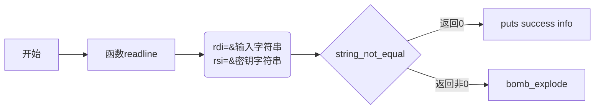

## Bomb Lab Procedure

This is an x86-64 bomb for self-study students. 

**ATTENTION:**
if `gdb` says its authority  not enough, 
`sudo su`
`chmod 777 bomb `

#### 准备工作

首先使用`Linux objdump`工具反汇编保存bomb二进制文件的反汇编代码bomb.asm

```bash
objdump -d bomb > bomb.asm
```

再开启`gdb`调试bomb二进制文件

```bash
gdb bomb
```

**注意**

`gdb run`可能会提示权限不够，要修改成可读可写可执行，输入命令

```bash
sudo su;
chomd 777 bomb
```

#### 查看代码

##### C 代码

首先查看`.c`代码，由于缺少头文件和其他文件，只能查看`bomb`的整体逻辑

这一段起始代码是尝试进行读文件操作，大概意识是拆除炸弹可以把所有的炸弹密钥字符串写入一个文档，然后将路径作为参数传递给`bomb`启动执行，如果没有传递参数，那么炸弹密钥通过命令行读取

```c
int main(int argc, char *argv[])
{
    char *input; //源代码38行

    /* Note to self: remember to port this bomb to Windows and put a 
     * fantastic GUI on it. */

    /* When run with no arguments, the bomb reads its input lines 
     * from standard input. */
    if (argc == 1) {  
	infile = stdin;
    } 

    /* When run with one argument <file>, the bomb reads from <file> 
     * until EOF, and then switches to standard input. Thus, as you 
     * defuse each phase, you can add its defusing string to <file> and
     * avoid having to retype it. */
    else if (argc == 2) {
	if (!(infile = fopen(argv[1], "r"))) {
	    printf("%s: Error: Couldn't open %s\n", argv[0], argv[1]);
	    exit(8);
	}
    }

    /* You can't call the bomb with more than 1 command line argument. */
    else {
	printf("Usage: %s [<input_file>]\n", argv[0]);
	exit(8);
    }
```

下面这一段是初始化炸弹` initialize_bomb();`想必是一个初始化函数，然后打印开始提示信息

```c
/* Do all sorts of secret stuff that makes the bomb harder to defuse. */ //66行
    initialize_bomb();

    printf("Welcome to my fiendish little bomb. You have 6 phases with\n");
    printf("which to blow yourself up. Have a nice day!\n");
```

主体部分，程序分为6个phase，每一个都需要你输入一行字符串，然后对应调用phase_n()函数进行判断是否触发炸弹

```c
/* Hmm...  Six phases must be more secure than one phase! */  //72
    input = read_line();             /* Get input                   */
    phase_1(input);                  /* Run the phase               */
    phase_defused();                 /* Drat!  They figured it out!
				      * Let me know how they did it. */
    printf("Phase 1 defused. How about the next one?\n");

    /* The second phase is harder.  No one will ever figure out
     * how to defuse this... */
    input = read_line();
    phase_2(input);
    phase_defused();
    printf("That's number 2.  Keep going!\n");

    /* I guess this is too easy so far.  Some more complex code will
     * confuse people. */
    input = read_line();
    phase_3(input);
    phase_defused();
    printf("Halfway there!\n");

    /* Oh yeah?  Well, how good is your math?  Try on this saucy problem! */
    input = read_line();
    phase_4(input);
    phase_defused();
    printf("So you got that one.  Try this one.\n");
    
    /* Round and 'round in memory we go, where we stop, the bomb blows! */
    input = read_line();
    phase_5(input);
    phase_defused();
    printf("Good work!  On to the next...\n");

    /* This phase will never be used, since no one will get past the
     * earlier ones.  But just in case, make this one extra hard. */
    input = read_line();
    phase_6(input);
    phase_defused();

    /* Wow, they got it!  But isn't something... missing?  Perhaps
     * something they overlooked?  Mua ha ha ha ha! */
    
    return 0;
```

##### 反汇编代码

先定位到main

```asm
0000000000400da0 <main>:
  400da0:	53                   	push   %rbx
  400da1:	83 ff 01             	cmp    $0x1,%edi
  400da4:	75 10                	jne    400db6 <main+0x16>
  400da6:	48 8b 05 9b 29 20 00 	mov    0x20299b(%rip),%rax        # 603748 <stdin@@GLIBC_2.2.5>
  400dad:	48 89 05 b4 29 20 00 	mov    %rax,0x2029b4(%rip)        # 603768 <infile>
  400db4:	eb 63                	jmp    400e19 <main+0x79>
  400db6:	48 89 f3             	mov    %rsi,%rbx
  400db9:	83 ff 02             	cmp    $0x2,%edi
  400dbc:	75 3a                	jne    400df8 <main+0x58>
  400dbe:	48 8b 7e 08          	mov    0x8(%rsi),%rdi
  400dc2:	be b4 22 40 00       	mov    $0x4022b4,%esi
  400dc7:	e8 44 fe ff ff       	callq  400c10 <fopen@plt>
  400dcc:	48 89 05 95 29 20 00 	mov    %rax,0x202995(%rip)        # 603768 <infile>
  400dd3:	48 85 c0             	test   %rax,%rax
  400dd6:	75 41                	jne    400e19 <main+0x79>
  400dd8:	48 8b 4b 08          	mov    0x8(%rbx),%rcx
  400ddc:	48 8b 13             	mov    (%rbx),%rdx
  400ddf:	be b6 22 40 00       	mov    $0x4022b6,%esi
  400de4:	bf 01 00 00 00       	mov    $0x1,%edi
  400de9:	e8 12 fe ff ff       	callq  400c00 <__printf_chk@plt>
  400dee:	bf 08 00 00 00       	mov    $0x8,%edi
  400df3:	e8 28 fe ff ff       	callq  400c20 <exit@plt>
  400df8:	48 8b 16             	mov    (%rsi),%rdx
  400dfb:	be d3 22 40 00       	mov    $0x4022d3,%esi
  400e00:	bf 01 00 00 00       	mov    $0x1,%edi
  400e05:	b8 00 00 00 00       	mov    $0x0,%eax
  400e0a:	e8 f1 fd ff ff       	callq  400c00 <__printf_chk@plt>
  400e0f:	bf 08 00 00 00       	mov    $0x8,%edi
  400e14:	e8 07 fe ff ff       	callq  400c20 <exit@plt>
  400e19:	e8 84 05 00 00       	callq  4013a2 <initialize_bomb>;初始化炸弹
  
  
  ;gdb调试信息：
  ;(gdb) print (char*)(0x402338)
  ;$1 = 0x402338 "Welcome to my fiendish little bomb. You have 6 phases with"
  400e1e:	bf 38 23 40 00       	mov    $0x402338,%edi
  400e23:	e8 e8 fc ff ff       	callq  400b10 <puts@plt>
  ;gdb) print (char*)(0x402378)
  ;$2 = 0x402378 "which to blow yourself up. Have a nice day!"
  400e28:	bf 78 23 40 00       	mov    $0x402378,%edi
  400e2d:	e8 de fc ff ff       	callq  400b10 <puts@plt>;打印提示信息
  ; edi(第一参数寄存器)存放要打印的字符串的地址，通过callq  400b10 <puts@plt>打印
  ;=========================================================================
  ;下面一段就是一个炸弹,炸弹先调用read_line,然后将返回的地址传递给phase_n函数，
  ;如果输入的不正确那么就会执行爆炸函数输出bomb!
  ;
  ;
  ;; 获取输入字符串,rax返回值是字符串地址
  400e32:	e8 67 06 00 00       	callq  40149e <read_line>
  ;; 获取的输入字符串地址赋给rdi
  400e37:	48 89 c7             	mov    %rax,%rdi
  400e3a:	e8 a1 00 00 00       	callq  400ee0 <phase_1>
  400e3f:	e8 80 07 00 00       	callq  4015c4 <phase_defused>
  400e44:	bf a8 23 40 00       	mov    $0x4023a8,%edi
  400e49:	e8 c2 fc ff ff       	callq  400b10 <puts@plt>
  
  
  400e4e:	e8 4b 06 00 00       	callq  40149e <read_line>
  400e53:	48 89 c7             	mov    %rax,%rdi
  400e56:	e8 a1 00 00 00       	callq  400efc <phase_2>
  400e5b:	e8 64 07 00 00       	callq  4015c4 <phase_defused>
  400e60:	bf ed 22 40 00       	mov    $0x4022ed,%edi
  400e65:	e8 a6 fc ff ff       	callq  400b10 <puts@plt>
  
  
  400e6a:	e8 2f 06 00 00       	callq  40149e <read_line>
  400e6f:	48 89 c7             	mov    %rax,%rdi
  400e72:	e8 cc 00 00 00       	callq  400f43 <phase_3>
  400e77:	e8 48 07 00 00       	callq  4015c4 <phase_defused>
  400e7c:	bf 0b 23 40 00       	mov    $0x40230b,%edi
  400e81:	e8 8a fc ff ff       	callq  400b10 <puts@plt>
  
  
  400e86:	e8 13 06 00 00       	callq  40149e <read_line>
  400e8b:	48 89 c7             	mov    %rax,%rdi
  400e8e:	e8 79 01 00 00       	callq  40100c <phase_4>
  400e93:	e8 2c 07 00 00       	callq  4015c4 <phase_defused>
  400e98:	bf d8 23 40 00       	mov    $0x4023d8,%edi
  400e9d:	e8 6e fc ff ff       	callq  400b10 <puts@plt>
  
  
  400ea2:	e8 f7 05 00 00       	callq  40149e <read_line>
  400ea7:	48 89 c7             	mov    %rax,%rdi
  400eaa:	e8 b3 01 00 00       	callq  401062 <phase_5>
  400eaf:	e8 10 07 00 00       	callq  4015c4 <phase_defused>
  400eb4:	bf 1a 23 40 00       	mov    $0x40231a,%edi
  400eb9:	e8 52 fc ff ff       	callq  400b10 <puts@plt>
  
  
  400ebe:	e8 db 05 00 00       	callq  40149e <read_line>
  400ec3:	48 89 c7             	mov    %rax,%rdi
  400ec6:	e8 29 02 00 00       	callq  4010f4 <phase_6>
  400ecb:	e8 f4 06 00 00       	callq  4015c4 <phase_defused>
  400ed0:	b8 00 00 00 00       	mov    $0x0,%eax
  400ed5:	5b                   	pop    %rbx
  400ed6:	c3                   	retq   
  400ed7:	90                   	nop
  400ed8:	90                   	nop
  400ed9:	90                   	nop
  400eda:	90                   	nop
  400edb:	90                   	nop
  400edc:	90                   	nop
  400edd:	90                   	nop
  400ede:	90                   	nop
  400edf:	90                   	nop
```

查看`read_line`

```asm
000000000040149e <read_line>:
  40149e:	48 83 ec 08          	sub    $0x8,%rsp
  4014a2:	b8 00 00 00 00       	mov    $0x0,%eax
  4014a7:	e8 4d ff ff ff       	callq  4013f9 <skip>
  4014ac:	48 85 c0             	test   %rax,%rax
  4014af:	75 6e                	jne    40151f <read_line+0x81>
  4014b1:	48 8b 05 90 22 20 00 	mov    0x202290(%rip),%rax        # 603748 <stdin@@GLIBC_2.2.5>
  4014b8:	48 39 05 a9 22 20 00 	cmp    %rax,0x2022a9(%rip)        # 603768 <infile>
  4014bf:	75 14                	jne    4014d5 <read_line+0x37>
  4014c1:	bf d5 25 40 00       	mov    $0x4025d5,%edi
  4014c6:	e8 45 f6 ff ff       	callq  400b10 <puts@plt>
  4014cb:	bf 08 00 00 00       	mov    $0x8,%edi
  4014d0:	e8 4b f7 ff ff       	callq  400c20 <exit@plt>
  4014d5:	bf f3 25 40 00       	mov    $0x4025f3,%edi
  4014da:	e8 01 f6 ff ff       	callq  400ae0 <getenv@plt>
  
  4014df:	48 85 c0             	test   %rax,%rax
  ; rax为零则跳转到4014ee,否则edi清零并callq  400c20 <exit@plt>
  4014e2:	74 0a                	je     4014ee <read_line+0x50>
  4014e4:	bf 00 00 00 00       	mov    $0x0,%edi
  4014e9:	e8 32 f7 ff ff       	callq  400c20 <exit@plt>
  
  4014ee:	48 8b 05 53 22 20 00 	mov    0x202253(%rip),%rax        # 603748 <stdin@@GLIBC_2.2.5>
  4014f5:	48 89 05 6c 22 20 00 	mov    %rax,0x20226c(%rip)        # 603768 <infile>
  4014fc:	b8 00 00 00 00       	mov    $0x0,%eax
  401501:	e8 f3 fe ff ff       	callq  4013f9 <skip>
  401506:	48 85 c0             	test   %rax,%rax
  401509:	75 14                	jne    40151f <read_line+0x81>
  40150b:	bf d5 25 40 00       	mov    $0x4025d5,%edi
  401510:	e8 fb f5 ff ff       	callq  400b10 <puts@plt>
  401515:	bf 00 00 00 00       	mov    $0x0,%edi
  40151a:	e8 01 f7 ff ff       	callq  400c20 <exit@plt>
  40151f:	8b 15 3b 22 20 00    	mov    0x20223b(%rip),%edx        # 603760 <num_input_strings>
  401525:	48 63 c2             	movslq %edx,%rax
  401528:	48 8d 34 80          	lea    (%rax,%rax,4),%rsi
  40152c:	48 c1 e6 04          	shl    $0x4,%rsi
  401530:	48 81 c6 80 37 60 00 	add    $0x603780,%rsi
  401537:	48 89 f7             	mov    %rsi,%rdi
  40153a:	b8 00 00 00 00       	mov    $0x0,%eax
  40153f:	48 c7 c1 ff ff ff ff 	mov    $0xffffffffffffffff,%rcx
  401546:	f2 ae                	repnz scas %es:(%rdi),%al
  401548:	48 f7 d1             	not    %rcx
  40154b:	48 83 e9 01          	sub    $0x1,%rcx
  40154f:	83 f9 4e             	cmp    $0x4e,%ecx
  ;ecx有符号小于等于0x4e则跳转到40159a(引爆炸弹的下一条指令处)
  401552:	7e 46                	jle    40159a <read_line+0xfc> 
  
  401554:	bf fe 25 40 00       	mov    $0x4025fe,%edi
  401559:	e8 b2 f5 ff ff       	callq  400b10 <puts@plt>
  40155e:	8b 05 fc 21 20 00    	mov    0x2021fc(%rip),%eax        # 603760 <num_input_strings>
  401564:	8d 50 01             	lea    0x1(%rax),%edx
  401567:	89 15 f3 21 20 00    	mov    %edx,0x2021f3(%rip)        # 603760 <num_input_strings>
  40156d:	48 98                	cltq   
  40156f:	48 6b c0 50          	imul   $0x50,%rax,%rax
  401573:	48 bf 2a 2a 2a 74 72 	movabs $0x636e7572742a2a2a,%rdi
  40157a:	75 6e 63 
  40157d:	48 89 b8 80 37 60 00 	mov    %rdi,0x603780(%rax)
  401584:	48 bf 61 74 65 64 2a 	movabs $0x2a2a2a64657461,%rdi
  40158b:	2a 2a 00 
  40158e:	48 89 b8 88 37 60 00 	mov    %rdi,0x603788(%rax)
  401595:	e8 a0 fe ff ff       	callq  40143a <explode_bomb> ;引爆炸弹
  40159a:	83 e9 01             	sub    $0x1,%ecx
  40159d:	48 63 c9             	movslq %ecx,%rcx
  4015a0:	48 63 c2             	movslq %edx,%rax
  4015a3:	48 8d 04 80          	lea    (%rax,%rax,4),%rax
  4015a7:	48 c1 e0 04          	shl    $0x4,%rax
  4015ab:	c6 84 01 80 37 60 00 	movb   $0x0,0x603780(%rcx,%rax,1)
  4015b2:	00 
  4015b3:	83 c2 01             	add    $0x1,%edx
  4015b6:	89 15 a4 21 20 00    	mov    %edx,0x2021a4(%rip)        # 603760 <num_input_strings>
  4015bc:	48 89 f0             	mov    %rsi,%rax
  4015bf:	48 83 c4 08          	add    $0x8,%rsp
  4015c3:	c3                   	retq   
```

`strings_not_equal`函数

```asm
0000000000401338 <strings_not_equal>:
  401338:	41 54                	push   %r12
  40133a:	55                   	push   %rbp 
  40133b:	53                   	push   %rbx ; rbp,rbx压栈,说明该函数要使用
  ; 分别赋值rdi,rsi,说明匹配的字符串地址应该在rdi,rsi处
  40133c:	48 89 fb             	mov    %rdi,%rbx ;
  40133f:	48 89 f5             	mov    %rsi,%rbp 
  
  401342:	e8 d4 ff ff ff       	callq  40131b <string_length>
  401347:	41 89 c4             	mov    %eax,%r12d
  40134a:	48 89 ef             	mov    %rbp,%rdi
  40134d:	e8 c9 ff ff ff       	callq  40131b <string_length>
  401352:	ba 01 00 00 00       	mov    $0x1,%edx
  401357:	41 39 c4             	cmp    %eax,%r12d
  40135a:	75 3f                	jne    40139b <strings_not_equal+0x63>
  40135c:	0f b6 03             	movzbl (%rbx),%eax
  40135f:	84 c0                	test   %al,%al
  401361:	74 25                	je     401388 <strings_not_equal+0x50>
  401363:	3a 45 00             	cmp    0x0(%rbp),%al
  401366:	74 0a                	je     401372 <strings_not_equal+0x3a>
  401368:	eb 25                	jmp    40138f <strings_not_equal+0x57>
  40136a:	3a 45 00             	cmp    0x0(%rbp),%al
  40136d:	0f 1f 00             	nopl   (%rax)
  401370:	75 24                	jne    401396 <strings_not_equal+0x5e>
  401372:	48 83 c3 01          	add    $0x1,%rbx
  401376:	48 83 c5 01          	add    $0x1,%rbp
  40137a:	0f b6 03             	movzbl (%rbx),%eax
  40137d:	84 c0                	test   %al,%al
  40137f:	75 e9                	jne    40136a <strings_not_equal+0x32>
  401381:	ba 00 00 00 00       	mov    $0x0,%edx
  401386:	eb 13                	jmp    40139b <strings_not_equal+0x63>
  401388:	ba 00 00 00 00       	mov    $0x0,%edx
  40138d:	eb 0c                	jmp    40139b <strings_not_equal+0x63>
  40138f:	ba 01 00 00 00       	mov    $0x1,%edx
  401394:	eb 05                	jmp    40139b <strings_not_equal+0x63>
  401396:	ba 01 00 00 00       	mov    $0x1,%edx
  40139b:	89 d0                	mov    %edx,%eax
  40139d:	5b                   	pop    %rbx
  40139e:	5d                   	pop    %rbp
  40139f:	41 5c                	pop    %r12
  4013a1:	c3                   	retq   
```


#### 第一个炸弹

```asm
0000000000400ee0 <phase_1>:
  400ee0:	48 83 ec 08          	sub    $0x8,%rsp ;申请8字节栈空间
  ;给寄存器esi(rsi低32位)赋值,应该是一个地址,esi(rsi)是第二个参数寄存器
  400ee4:	be 00 24 40 00       	mov    $0x402400,%esi ;
  ;调用匹配字符串函数
  400ee9:	e8 4a 04 00 00       	callq  401338 <strings_not_equal>
  ;测试匹配函数结束后的eax(返回值rax低32位)寄存器值,若0,栈复原退出,否则调用炸弹爆炸函数
  400eee:	85 c0                	test   %eax,%eax
  400ef0:	74 05                	je     400ef7 <phase_1+0x17>
  400ef2:	e8 43 05 00 00       	callq  40143a <explode_bomb>
  400ef7:	48 83 c4 08          	add    $0x8,%rsp
  400efb:	c3                   	retq   
```

结合phase1的代码

```asm
 ;; 获取输入字符串,rax返回值是字符串地址
  400e32:	e8 67 06 00 00       	callq  40149e <read_line>
  ;; 获取的输入字符串地址赋给rdi
  400e37:	48 89 c7             	mov    %rax,%rdi
  400e3a:	e8 a1 00 00 00       	callq  400ee0 <phase_1>
  400e3f:	e8 80 07 00 00       	callq  4015c4 <phase_defused>
  400e44:	bf a8 23 40 00       	mov    $0x4023a8,%edi 
  400e49:	e8 c2 fc ff ff       	callq  400b10 <puts@plt>
```

`read_line`函数会将读入字符串地址存放在`rdi `和`rsi`中，`strings_not_equa`l函数会使用`edi`和`esi`中的值当做两个字符址，并且判断他们是否相等，相等返回0

`edi`存放的是`callq  400b10 <puts@plt>`要打印的信息的地址，用gdb调试

```bash
(gdb) print (char*)(0x4023a8)
$3 = 0x4023a8 "Phase 1 defused. How about the next one?"
```

可见打印的是成功拆除的信息。因此，炸弹1的整体逻辑就是



于是，重点在于找到给`rsi`赋地址的语句，这个地址存储的就是密钥字符串

```asm
0000000000400ee0 <phase_1>:
  400ee0:	48 83 ec 08          	sub    $0x8,%rsp ;申请8字节栈空间
  ;给寄存器esi(rsi低32位)赋值,应该是一个地址,esi(rsi)是第二个参数寄存器
  400ee4:	be 00 24 40 00       	mov    $0x402400,%esi ; rsi赋地址语句
```

`esi`是`rsi`的低32位，400ee4给`esi`赋值就是给`rsi`赋值为密钥字符串地址

`gdb`调试

```bash
(gdb) print (char*) (0x402400)
$7 = 0x402400 "Border relations with Canada have never been better."
```

第一个炸弹的密钥就是**"Border relations with Canada have never been better."**

#### 第二个炸弹

查看`phase_2`代码

```asm
0000000000400efc <phase_2>:
  400efc:	55                   	push   %rbp
  400efd:	53                   	push   %rbx ; rbx rbp压栈，要被调用
  400efe:	48 83 ec 28          	sub    $0x28,%rsp ; 申请0x28=40字节栈帧
  400f02:	48 89 e6             	mov    %rsp,%rsi ; 将rsp值赋给rsi
  ;根据函数名,应该是读入六个数
  400f05:	e8 52 05 00 00       	callq  40145c <read_six_numbers>
  
  400f0a:	83 3c 24 01          	cmpl   $0x1,(%rsp); 查栈顶元素是否是1,
  													  ; 由下文分析可知phase_2栈顶存储的是第一个输入的值
  													  ; 因此密钥第一个数字必定是1
  400f0e:	74 20                	je     400f30 <phase_2+0x34>;是1，跳转到400f30进行首轮哨兵初始化等操作,不是则引爆炸弹
  400f10:	e8 25 05 00 00       	callq  40143a <explode_bomb> ;引爆炸弹
  400f15:	eb 19                	jmp    400f30 <phase_2+0x34> 
  
  ;取出rbx-4处的值赋给eax
  400f17:	8b 43 fc             	mov    -0x4(%rbx),%eax
  400f1a:	01 c0                	add    %eax,%eax; eax=2*eax
  ;比较eax*2和rbx处的值,注意:eax是rbx-4处的值，即将rbx和前一个数的两倍比较
  400f1c:	39 03                	cmp    %eax,(%rbx)
  ; rbx和前一个数的两倍相等则跳转
  400f1e:	74 05                	je     400f25 <phase_2+0x29> 
  ; 不相等引爆炸弹
  400f20:	e8 15 05 00 00       	callq  40143a <explode_bomb>
  ; rbx=rbx+4
  400f25:	48 83 c3 04          	add    $0x4,%rbx
  ; 将rbx和rbp比较
  ;将加4后的值和rbp比较，
  ;注意rbp是rsp+24 (400f30代码),而rsp是第一个数，一个数四个字节。那么rbp就应该是
  ;后那个数后面那个地址，即rbp是个循环哨兵
  400f29:	48 39 eb             	cmp    %rbp,%rbx
  ; 不相等跳转回rbx-4，继续取rbx前一个数的两倍与其比较
  400f2c:	75 e9                	jne    400f17 <phase_2+0x1b>
  ; 相等则直接跳转出去
  400f2e:	eb 0c                	jmp    400f3c <phase_2+0x40>
  
  400f30:	48 8d 5c 24 04       	lea    0x4(%rsp),%rbx ;将rsp+4存到rbx
  400f35:	48 8d 6c 24 18       	lea    0x18(%rsp),%rbp ; 将rsp +24 存到rbp
  ; 无条件跳回去,取rbx前一个数的两倍与其比较
  400f3a:	eb db                	jmp    400f17 <phase_2+0x1b> 
  
  400f3c:	48 83 c4 28          	add    $0x28,%rsp
  400f40:	5b                   	pop    %rbx
  400f41:	5d                   	pop    %rbp
  400f42:	c3                   	retq   
```

查看`read_six_number`代码

内部调用了`sscanf` 这个函数（功能是从一个字符串中读取一定格式的数据，和 `scanf` 一样，除了 `scanf` 是从标准输入流中读取）。参数顺序分别是，待读取内容的字符串(`rdi`)、用于格式读取的格式化字符串(`rsi`)，还有各个变量读取后存放的地址(`rdx`)。返回读到的有效数据个数

- `%rdx`由 `%rsi` 给出，`%rsi` 又由 `phrase2` 的 `%rsp` 给出，所以 `phrase2` 中的 `%rsp` 地址处存放 `sscanf` 中第1个输入的值。

```asm
000000000040145c <read_six_numbers>:
  40145c:	48 83 ec 18          	sub    $0x18,%rsp ; 申请0x18=24字节栈帧
  401460:	48 89 f2             	mov    %rsi,%rdx; rdx=rsi
  401463:	48 8d 4e 04          	lea    0x4(%rsi),%rcx; rcx=rsi+4
  
  ;                                       	rax=rsi+0x14
  401467:	48 8d 46 14          	lea    0x14(%rsi),%rax
  40146b:	48 89 44 24 08       	mov    %rax,0x8(%rsp);将rax存入rsp+8处
  ;此时栈
  ;| ......... |  <- rsi,rdx 
  ;|  返回地址  |
  ;|           |
  ;|  rsi+0x14 |
  ;|           |  <- rsp
  
  401470:	48 8d 46 10          	lea    0x10(%rsi),%rax; rax=rsi+0x10
  401474:	48 89 04 24          	mov    %rax,(%rsp); 将rax存入rsp处
  ;此时栈
  ;| ......... |  <- rsi,rdx 
  ;|  返回地址  |
  ;|           |
  ;|  rsi+0x14 |
  ;|  rsi+0x10 |  <- rsp
  401478:	4c 8d 4e 0c          	lea    0xc(%rsi),%r9
  40147c:	4c 8d 46 08          	lea    0x8(%rsi),%r8
  
  
  ;将rsi赋值为0x4025c3
  401480:	be c3 25 40 00       	mov    $0x4025c3,%esi
  401485:	b8 00 00 00 00       	mov    $0x0,%eax
  ;调用了scanf
  40148a:	e8 61 f7 ff ff       	callq  400bf0 <__isoc99_sscanf@plt>
  
  
  40148f:	83 f8 05             	cmp    $0x5,%eax
  ; eax 大于5 跳转到401499准备返回,否则调用爆炸函数,eax存放的应该是读到的数字个数
  401492:	7f 05                	jg     401499 <read_six_numbers+0x3d>
  401494:	e8 a1 ff ff ff       	callq  40143a <explode_bomb>
  ; 释放栈帧，返回
  401499:	48 83 c4 18          	add    $0x18,%rsp
  40149d:	c3                   	retq   
```

- `%rcx`，`phrase2` 中的 `%rsp+0x4` 处存放第2个值
- `%r8`，`phrase2` 中的 `%rsp+0x8` 存放第3个值
- `%r9`，`phrase2` 中的 `%rsp+0xc` 存放第4个值

- 第5个、第6个值所在的地址需要通过压栈传参，参数的入栈顺序是从右至左。可知，`phrase2` 中的 `%rsp+0x10` 存放第五个值、`phrase2` 中的 `%rsp+0x14` 存放第六个值。第六个值先入栈，更加靠近栈底（高地址）。

打印0x4025c3处的值

```bash
(gdb) x /4wd 0x4025c3
0x4025c3:	622879781	1680154724	543434016	622879781
```

乱七八糟，尝试用字符串打印

```asm
(gdb) print (char*)0x4025c3
$5 = 0x4025c3 "%d %d %d %d %d %d"
```

这说明`sscanf`读取的确实是6个数字。可以确定，第2个炸弹的密钥是**1 2 4 8 16 32**

#### 第三个炸弹

查看`phase_3`代码

```asm
0000000000400f43 <phase_3>:
  400f43:	48 83 ec 18          	sub    $0x18,%rsp
  400f47:	48 8d 4c 24 0c       	lea    0xc(%rsp),%rcx ; rcx存储接受输入的第2个数字的地址
  400f4c:	48 8d 54 24 08       	lea    0x8(%rsp),%rdx ; rdx 是sscanf接受输入字符串的地址,为rsp+8
  
  400f51:	be cf 25 40 00       	mov    $0x4025cf,%esi ;esi(rsi)为sscanf的第二个参数,输入格式
  400f56:	b8 00 00 00 00       	mov    $0x0,%eax
  400f5b:	e8 90 fc ff ff       	callq  400bf0 <__isoc99_sscanf@plt> ; 又调用sscanf获取输入
  
```

代码开头就调用了`sscanf`，所以这个函数前面一定会有一个字符串常量存储需要读取的数据格式，函数的第二个参数用`rsi(esi)`存储，`400f51:`处代码告诉了`esi`的字符串首地址是`0x4025cf`，

使用`gdb`调试

```bash
(gdb) print (char*) 0x4025cf
$1 = 0x4025cf "%d %d"
```

确定这个炸弹的输入是两个数字

继续查看代码，发现其`cmp,jmp`等跳转指令很多，而且极其的有规律，猜测是个switch语句

```asm
  400f60:	83 f8 01             	cmp    $0x1,%eax ; eax与1比较,应该是返回值sscanf返回读到的2数据个数
  ; eax大于1 跳转L1,否则触发爆炸,因为密钥是2个数字,小于等于1个有效数据肯定错误
  400f63:	7f 05                	jg     400f6a <phase_3+0x27>
  400f65:	e8 d0 04 00 00       	callq  40143a <explode_bomb>
  ; L1, 结合上文代码,这是比较ssacnf获取的第一个输入数据和0x7的大小
  400f6a:	83 7c 24 08 07       	cmpl   $0x7,0x8(%rsp)
  ; 无符号大于7跳转到L2爆炸
  400f6f:	77 3c                	ja     400fad <phase_3+0x6a>
  ; 无符号小于等于7, 将eax赋值为sscanf获取的第一个输入
  400f71:	8b 44 24 08          	mov    0x8(%rsp),%eax
  ; 间接跳转, 跳转到 (0x402470+%rax*8)内存数据表示的地址,这是switch典型代码,0x402470存储的应该是一个跳转表
  400f75:	ff 24 c5 70 24 40 00 	jmpq   *0x402470(,%rax,8)
  ; 跳转表元素的每个数据应该是下面的一段,进行一次mov操作,修改eax值后统一跳转到400fbe处
  ; case1
  400f7c:	b8 cf 00 00 00       	mov    $0xcf,%eax
  400f81:	eb 3b                	jmp    400fbe <phase_3+0x7b>
  ; case2
  400f83:	b8 c3 02 00 00       	mov    $0x2c3,%eax
  400f88:	eb 34                	jmp    400fbe <phase_3+0x7b>
  ; case3
  400f8a:	b8 00 01 00 00       	mov    $0x100,%eax
  400f8f:	eb 2d                	jmp    400fbe <phase_3+0x7b>
  ; case4
  400f91:	b8 85 01 00 00       	mov    $0x185,%eax
  400f96:	eb 26                	jmp    400fbe <phase_3+0x7b>
  ; case5
  400f98:	b8 ce 00 00 00       	mov    $0xce,%eax
  400f9d:	eb 1f                	jmp    400fbe <phase_3+0x7b>
  ; case6
  400f9f:	b8 aa 02 00 00       	mov    $0x2aa,%eax
  400fa4:	eb 18                	jmp    400fbe <phase_3+0x7b>
  ; case7
  400fa6:	b8 47 01 00 00       	mov    $0x147,%eax
  400fab:	eb 11                	jmp    400fbe <phase_3+0x7b>
  ; L2 触发爆炸
  400fad:	e8 88 04 00 00       	callq  40143a <explode_bomb>
  400fb2:	b8 00 00 00 00       	mov    $0x0,%eax
  400fb7:	eb 05                	jmp    400fbe <phase_3+0x7b>
  ;?
  400fb9:	b8 37 01 00 00       	mov    $0x137,%eax
  ; case 结束后跳转到的地方
  ; 显然这里是把ssacnf获取的第二个输入数字与case处理后的eax比较
  400fbe:	3b 44 24 0c          	cmp    0xc(%rsp),%eax
  ; 若相等,则复原栈帧跳出去
  400fc2:	74 05                	je     400fc9 <phase_3+0x86>
  ; 不等就爆炸
  400fc4:	e8 71 04 00 00       	callq  40143a <explode_bomb>
  400fc9:	48 83 c4 18          	add    $0x18,%rsp
  400fcd:	c3                   	retq   
```

因此本题答案可不唯一，第一个数字应该无符号小于等于7，

`gdb`打印跳转表

```bash
(gdb) x /8gx 0x402470
0x402470:	0x0000000000400f7c [case1]		0x0000000000400fb9 [?]
0x402480:	0x0000000000400f83 [case2]     	0x0000000000400f8a [case3]
0x402490:	0x0000000000400f91 [case4]		0x0000000000400f98 [case5]
0x4024a0:	0x0000000000400f9f [case6]      0x0000000000400fa6 [case7]
```

因此 假设第一个数字是0，那么跳转到的是`case1`，`eax=0xcf`，第二个数字得是`0xcf=207`

第一个数字是1，跳转到？,`eax=0x137=311`

#### 第四个炸弹

查看`phase_4`代码，考察的是函数递归调用

```asm
000000000040100c <phase_4>:
  40100c:	48 83 ec 18          	sub    $0x18,%rsp ; 申请0x18=24直接栈帧
  ;| phase_4 ret addr |
  ;|                  |	 <- rcx   (sscanf 输入2nd)
  ;|                  |  <- rdx   (sscanf 输入1st)
  ;|                  |  <- rsp
  401010:	48 8d 4c 24 0c       	lea    0xc(%rsp),%rcx
  401015:	48 8d 54 24 08       	lea    0x8(%rsp),%rdx ; sscanf获取的输入存放的地址
  
  
  40101a:	be cf 25 40 00       	mov    $0x4025cf,%esi;esi(rsi)为sscanf的第二个参数,输入格式
  40101f:	b8 00 00 00 00       	mov    $0x0,%eax ; eax(rax)清零 
  401024:	e8 c7 fb ff ff       	callq  400bf0 <__isoc99_sscanf@plt>; 调用sscanf
  401029:	83 f8 02             	cmp    $0x2,%eax; sscanf返回的eax是有效数据个数，判断是否是2
  ; 不相等跳转到爆炸处,有效输入个数不是2,必然和密钥不匹配,错误
  40102c:	75 07                	jne    401035 <phase_4+0x29>
  ; 是2个有效输入,比较第一个输入和0xe=14
  40102e:	83 7c 24 08 0e       	cmpl   $0xe,0x8(%rsp)
  ; 第一个输入无符号小于等于14 跳转避开炸弹,否则到401035处爆炸
  401033:	76 05                	jbe    40103a <phase_4+0x2e>
  ; 引爆炸弹
  401035:	e8 00 04 00 00       	callq  40143a <explode_bomb>
  ; 避开炸弹跳转点,将edx置为0xe=14
  40103a:	ba 0e 00 00 00       	mov    $0xe,%edx
  ; esi清零
  40103f:	be 00 00 00 00       	mov    $0x0,%esi
  ; edi置为sscanf获取的第一个输入
  401044:	8b 7c 24 08          	mov    0x8(%rsp),%edi
  ; 调用func4函数
  ;| phase_4 ret addr |
  ;|                  |	 <- rcx   (sscanf 输入2nd)
  ;|                  |  <- rdx   (sscanf 输入1st)
  ;|                  | 
  ;| func4  ret addr  |  <- rsp
  ;|                  |
  401048:	e8 81 ff ff ff       	callq  400fce <func4>
  ; 调用结束后检查 eax
  40104d:	85 c0                	test   %eax,%eax
  ;  返回值非零引爆炸弹
  40104f:	75 07                	jne    401058 <phase_4+0x4c>
  ; 返回值为零 将第二个输入与0做比较
  401051:	83 7c 24 0c 00       	cmpl   $0x0,0xc(%rsp)
  ; 第二个输入是0 则跳出,否则仍然引爆炸弹
  401056:	74 05                	je     40105d <phase_4+0x51>
  ; 引爆炸弹
  401058:	e8 dd 03 00 00       	callq  40143a <explode_bomb>
  40105d:	48 83 c4 18          	add    $0x18,%rsp
  401061:	c3                   	retq  
```

又调用了`sscanf`函数，`esi`与`phase_3`中地址相同，因此输入格式又是`"%d %d"`


其调用了一个函数`func4`

```asm
0000000000400fce <func4>:
  400fce:	48 83 ec 08          	sub    $0x8,%rsp ;申请8字节栈帧
  ;| phase_4 ret addr |
  ;|      ...         |	 <- rcx (ecx)   (sscanf 输入2nd)
  ;|      ...         |  <- rdx (edx)  (sscanf 输入1st)
  ;|                  | 
  ;| func4  ret addr  |  
  ;|                  |  <- rsp
  ; 初次调用:edx=14,esi=0, edi = sscanf input 1
  ; 此前edx被赋值为0xe=14,现eax=14
  400fd2:	89 d0                	mov    %edx,%eax
  ; eax=eax-esi  更新eax
  400fd4:	29 f0                	sub    %esi,%eax
  ; ecx=eax
  400fd6:	89 c1                	mov    %eax,%ecx
  ; 将ecx逻辑右移(加0右移)31位,ecx长为32位,也就是之前的最高位变为最低位,其余31位填充补0
  400fd8:	c1 e9 1f             	shr    $0x1f,%ecx
  ; eax=eax+(eax最高位)
  400fdb:	01 c8                	add    %ecx,%eax
  ; 这里是一个缩写 sar $1,%eax (对应的机器码为 D1F8)  eax = eax/2
  400fdd:	d1 f8                	sar    %eax
  ; ecx= rax+rsi
  400fdf:	8d 0c 30             	lea    (%rax,%rsi,1),%ecx
  ; ecx和edi比较
  400fe2:	39 f9                	cmp    %edi,%ecx
  ; ecx小于等于edi则跳至另一个递归方案
  400fe4:	7e 0c                	jle    400ff2 <func4+0x24>
  ; 否则 edx=rcx-1
  400fe6:	8d 51 ff             	lea    -0x1(%rcx),%edx
  ; 递归调用func4
  400fe9:	e8 e0 ff ff ff       	callq  400fce <func4>
  ; eax=2*eax
  400fee:	01 c0                	add    %eax,%eax
  ; 本层递归结束,递归出口，回上一层递归
  400ff0:	eb 15                	jmp    401007 <func4+0x39>
  ; 另一个递归方案 , eax清零
  400ff2:	b8 00 00 00 00       	mov    $0x0,%eax
  400ff7:	39 f9                	cmp    %edi,%ecx
  ; 递归出口,回上一层递归
  400ff9:	7d 0c                	jge    401007 <func4+0x39>
  400ffb:	8d 71 01             	lea    0x1(%rcx),%esi
  400ffe:	e8 cb ff ff ff       	callq  400fce <func4>
  401003:	8d 44 00 01          	lea    0x1(%rax,%rax,1),%eax
  ; 返回
  401007:	48 83 c4 08          	add    $0x8,%rsp
  40100b:	c3                   	retq  
```

尝试将func4由汇编翻译回`C`代码，

```c
#include <stdio.h>
int func4(int edi, int esi, int edx) {
    int temp = (edx - esi);
    int ecx=(temp>>31)&(0x0001);
    temp+=ecx;
    temp=temp>>1;
    int mid = temp + esi;
    if (mid > edi) {
        edx = mid - 1;
        int ret1 = func4(edi, esi, edx);
        return 2 * ret1;
    } else {
        if (mid >= edi) {
            return 0;
        } else {
            esi = mid + 1;
            int ret2 = func4(edi, esi, edx);
            return (2 * ret2 + 1);
        }
    }
}
int main() {
    for (int edi = 0; edi < 10; edi++) {
        int res = func4(edi, 0, 14);
        printf("edi=%d, res=%d\n", edi, res);
    }
    return 0;
}
```

```bash
> gcc -o test .\bombPhase4.c
> .\test.exe
edi=0, res=0
edi=1, res=0
edi=2, res=4
edi=3, res=0
edi=4, res=2
edi=5, res=2
edi=6, res=6
edi=7, res=0
edi=8, res=1
edi=9, res=1
```

因此，**7 0、3 0 、1 0**等均可

#### 第五个炸弹

查看`phase_5`代码

```asm
0000000000401062 <phase_5>:
  401062:	53                   	push   %rbx ; rbx入栈,本函数要使用rbx
  401063:	48 83 ec 20          	sub    $0x20,%rsp ; 申请0x20=32字节大小的栈帧
  ;|   phase_5 ret addr   |
  ;|        %rbx          |
  ;|                      |
  ;|                      |
  ;|                      |
  ;|                      | <-rsp
  
  401067:	48 89 fb             	mov    %rdi,%rbx	; rbx=rdi (rdi=&输入字符串,可由read_line分析得到) 
  ; 反汇编的at&t风格代码
  40106a:	64 48 8b 04 25 28 00 	mov    %fs:0x28,%rax ;把fs选择子的偏移值0x28(64bit)放入rax(64bit暂存器)
														 
  401071:	00 00 
  401073:	48 89 44 24 18       	mov    %rax,0x18(%rsp)
  ;|   phase_5 ret addr   |
  ;|        %rbx          |
  ;|        %rax          |
  ;|                      |
  ;|                      |
  ;|                      | <-rsp
  
  401078:	31 c0                	xor    %eax,%eax ; eax清零
  40107a:	e8 9c 02 00 00       	callq  40131b <string_length> ; 猜测是获取字符串长度返回eax
  40107f:	83 f8 06             	cmp    $0x6,%eax ; 判断输入字符串长度是否是6
  ; 如果长度是6,跳转L2 清零eax(rax低32位,这里可视为rax)
  401082:	74 4e                	je     4010d2 <phase_5+0x70>
  ; 长度不是6,引爆炸弹
  401084:	e8 b1 03 00 00       	callq  40143a <explode_bomb>
  401089:	eb 47                	jmp    4010d2 <phase_5+0x70>
  ; L1 跳回 循环点   初次从L2跳来, eax为零
  ; 这里是根据输入的6字节字符串低4位为序号从另一个字符串中取字符存到栈的rsp+0x10为最低地址处
  40108b:	0f b6 0c 03          	movzbl (%rbx,%rax,1),%ecx ; ecx= rbx(&输入字符串)+rax(当前匹配的字符序号)
  40108f:	88 0c 24             	mov    %cl,(%rsp) ; 在栈顶存储%cl (rcx最低字节)
  401092:	48 8b 14 24          	mov    (%rsp),%rdx 	; rdx=%cl
  401096:	83 e2 0f             	and    $0xf,%edx 	; edx高位清零,只留下最低4位
  401099:	0f b6 92 b0 24 40 00 	movzbl 0x4024b0(%rdx), %edx ; edx= M[0x4024b0+%rdx]零扩展字节至双字
  4010a0:	88 54 04 10          	mov    %dl,0x10(%rsp,%rax,1); M[rsp+rax+0x10]处存入%dl(%edx低字节)
  4010a4:	48 83 c0 01          	add    $0x1,%rax	; rax++ , rax存放的应该是当前匹配的字符序号
  4010a8:	48 83 f8 06          	cmp    $0x6,%rax	; 比较取完没
  4010ac:	75 dd                	jne    40108b <phase_5+0x29> ; 没有取完全部6个,返回L1循环
  
  ; rsp+0x10---rsp+0x15 存储的取出的新6字节字符串 , 将 rsp+0x16清零,即字符串末尾标志'\0'
  4010ae:	c6 44 24 16 00       	movb   $0x0,0x16(%rsp)
  ; esi 存储 要和比较的字符串基址
  4010b3:	be 5e 24 40 00       	mov    $0x40245e,%esi
  ; rdi 存储 rsp+0x10,即新字符串的地址
  4010b8:	48 8d 7c 24 10       	lea    0x10(%rsp),%rdi
  ;进行比较;
  ;由之前分析strings_not_equal函数使用edi和esi中的值当做两个字符址，并且判断他们是否相等，相等返回0
  4010bd:	e8 76 02 00 00       	callq  401338 <strings_not_equal>
  ; 判断返回值是否是0
  4010c2:	85 c0                	test   %eax,%eax
  ; 为零说明完全匹配成功,跳到L3退出
  4010c4:	74 13                	je     4010d9 <phase_5+0x77>
  ; 不为零说明无法完全匹配,爆炸
  4010c6:	e8 6f 03 00 00       	callq  40143a <explode_bomb>
  4010cb:	0f 1f 44 00 00       	nopl   0x0(%rax,%rax,1)
  4010d0:	eb 07                	jmp    4010d9 <phase_5+0x77>
  ;L2 eax清零后跳回L1
  4010d2:	b8 00 00 00 00       	mov    $0x0,%eax 
  4010d7:	eb b2                	jmp    40108b <phase_5+0x29>
  ;L3:
  4010d9:	48 8b 44 24 18       	mov    0x18(%rsp),%rax
  4010de:	64 48 33 04 25 28 00 	xor    %fs:0x28,%rax
  4010e5:	00 00 
  4010e7:	74 05                	je     4010ee <phase_5+0x8c>
  4010e9:	e8 42 fa ff ff       	callq  400b30 <__stack_chk_fail@plt>
  4010ee:	48 83 c4 20          	add    $0x20,%rsp
  4010f2:	5b                   	pop    %rbx
  4010f3:	c3                   	retq   
```

1. 要求输入6个字符，然后依次循环这个输入的字符数组
2. 每一轮循环取一个字符，然后取这个字符的后四位作为索引，在第二个字符常量`0x4024b0`处取一个字符依次存放到`%rsp+0x10+i`处

 ```bash
(gdb) print (char*)0x4024b0
$1 = 0x4024b0 <array> "maduiersnfotvbylSo you think you can stop the bomb with ctrl-c, do you?"
 ```

​	3. 将新`0x10(%rsp)`处的字符串和`0x40245e`处的字符串比较，相同则通过，否则爆炸

```bash
(gdb) print (char*)0x40245e
$2 = 0x40245e "flyers"
```

由于低4位只能表示0-15,因此只能从`<array>: maduiersnfotvbyl`取得

`f :array[9] 1001=9`，查找`ASCII`表低位为9的字符:`)9IYiy`

`l :array[15] 1111`=F, `/?O_0`
`y :array[14] 1110=E ` , `.>N^n~`

`e :array[5] 5`,`%5EUeu`

`r :array[6] 6`, `&6FVfv`

`s :array[7] 7`, `,7GWgw`

答案多种，如**`YONEFw` 、`y?nevw`**

`string_length`代码

```asm
000000000040131b <string_length>:
  40131b:	80 3f 00             	cmpb   $0x0,(%rdi)
  40131e:	74 12                	je     401332 <string_length+0x17>
  401320:	48 89 fa             	mov    %rdi,%rdx
  401323:	48 83 c2 01          	add    $0x1,%rdx
  401327:	89 d0                	mov    %edx,%eax
  401329:	29 f8                	sub    %edi,%eax
  40132b:	80 3a 00             	cmpb   $0x0,(%rdx)
  40132e:	75 f3                	jne    401323 <string_length+0x8>
  401330:	f3 c3                	repz retq 
  401332:	b8 00 00 00 00       	mov    $0x0,%eax
  401337:	c3                   	retq   
```

结合`read_line`，应该是获取`rdi`为地址的字符串的长度返回给`eax(rax)`

#### 第六个炸弹

查看`phase_6`代码

```asm
00000000004010f4 <phase_6>:
  4010f4:	41 56                	push   %r14
  4010f6:	41 55                	push   %r13
  4010f8:	41 54                	push   %r12
  4010fa:	55                   	push   %rbp
  4010fb:	53                   	push   %rbx ; 寄存器入栈,将要被本函数调用
  
  4010fc:	48 83 ec 50          	sub    $0x50,%rsp; 申请80字节的栈帧
  ;|  phase_6 ret addr  |
  ;|                    |
  ;|                    |
  ;|                    |
  ;|                    |
  ;|                    |
  ;|                    |
  ;|                    |
  ;|                    |
  ;|                    |
  ;|                    | <- rsp <- r13 <- rsi
  401100:	49 89 e5             	mov    %rsp,%r13
  401103:	48 89 e6             	mov    %rsp,%rsi
  
  ;调用读取6数字函数,内部调用了sscanf
  ;sscanf参数顺序分别是，
  ;待读取内容的字符串(rdi)、
  ;用于格式读取的格式化字符串(rsi)，
  ;还有各个变量读取后存放的地址(rdx)。
  ; <read_six_numbers>中,%rdx由 %rsi 给出，%rsi 在 phrase6中 又由 %rsp 给出
  ; 因此输入的数字存到phase_6的%rsp处
  ;返回读到的有效数据个数
  401106:	e8 51 03 00 00       	callq  40145c <read_six_numbers>
  ;读入了 6 个数字，分别放入了 %rsp+0x0、%rsp+0x4、%rsp+0x8、%rsp+0xc、%rsp+0x10、%rsp+0x14
  40110b:	49 89 e6             	mov    %rsp,%r14 
  ; 先将r12(d低32位)置零
  ; r12 用于计数L4循环
  40110e:	41 bc 00 00 00 00    	mov    $0x0,%r12d
  ;====================================================================
  ;L4
  401114:	4c 89 ed             	mov    %r13,%rbp
  ; 初始情况
  ;|  phase_6 ret addr  |
  ;|                    |
  ;|                    |
  ;|                    |
  ;|                    |
  ;|                    |
  ;|                    |
  ;|                    |
  ;|  num6     num5     |
  ;|  num4     num3     |
  ;|  num2     num1     | <- rsp r13 r14 rbp rsi
  
  ; eax赋值为r13指向的内存数据
  401117:	41 8b 45 00          	mov    0x0(%r13),%eax
  ; eax=eax-1
  40111b:	83 e8 01             	sub    $0x1,%eax
  ; 将eax与 5比较
  40111e:	83 f8 05             	cmp    $0x5,%eax
  ; eax无符号<=5,跳过起爆函数至L1,否则爆炸,即原数据<=6
  401121:	76 05                	jbe    401128 <phase_6+0x34>
  401123:	e8 12 03 00 00       	callq  40143a <explode_bomb>
  ;L1: %r12d(r12低32位)++
  401128:	41 83 c4 01          	add    $0x1,%r12d
  ; 将r12d与6做比较
  40112c:	41 83 fc 06          	cmp    $0x6,%r12d
  ; r12=6则跳转至L2
  401130:	74 21                	je     401153 <phase_6+0x5f>
  ; 否则 ebx=r12d 
  401132:	44 89 e3             	mov    %r12d,%ebx
  ;L3: rax= ebx符号扩展4字 假设r12d=i
  401135:	48 63 c3             	movslq %ebx,%rax
  ; rax= M[rsp+4*rax]  假设r12d=i , 则rax=num(i)
  401138:	8b 04 84             	mov    (%rsp,%rax,4),%eax
  ; eax(rax)= num(i+1)与 M[rbp]=M[r13]=num(i)进行比较
  40113b:	39 45 00             	cmp    %eax,0x0(%rbp)
  ;不相等跳过爆炸函数
  40113e:	75 05                	jne    401145 <phase_6+0x51>
  ; 相等起爆
  401140:	e8 f5 02 00 00       	callq  40143a <explode_bomb>
  ; 跳过起爆函数 ebx++
  401145:	83 c3 01             	add    $0x1,%ebx
  ; 比较ebx和5
  401148:	83 fb 05             	cmp    $0x5,%ebx
  ; ebx<=5 跳转回L3,下一个num
  40114b:	7e e8                	jle    401135 <phase_6+0x41>
  ; ebx>=6, r13+=4
  40114d:	49 83 c5 04          	add    $0x4,%r13
  ; 跳回L4,将 r13 rbp等寄存器调整为指向栈中下一个num
  401151:	eb c1                	jmp    401114 <phase_6+0x20>
  ;==================================================================
  ;上述代码的作用是,确保输入的6个数字均<=6，并且num(i)不和num(i+1)~num(6)相同 
  ; 1<=i<=5
  ;==================================================================
  
  
  ;L2: r12=6跳转点;跳出上面的检查循环
  401153:	48 8d 74 24 18       	lea    0x18(%rsp),%rsi
  401158:	4c 89 f0             	mov    %r14,%rax
  ;|  phase_6 ret addr  |
  ;|                    |
  ;|                    |
  ;|                    |
  ;|                    |
  ;|                    |
  ;|                    |
  ;|                    | <- rsi
  ;|  num6     num5     |
  ;|  num4     num3     |
  ;|  num2     num1     | <- rsp r14 rax
  
  40115b:	b9 07 00 00 00       	mov    $0x7,%ecx
  ;L5: 循环,  num[i]=7-num[i] 6个输入数字全部对7求补
  401160:	89 ca                	mov    %ecx,%edx
  ; rcx=7, rdx=7
  401162:	2b 10                	sub    (%rax),%edx; edx=7-num(rax point)
  ; num(rax point)= edx=7-num(rax point) 
  401164:	89 10                	mov    %edx,(%rax)
  ; rax+=4指向下一个num
  401166:	48 83 c0 04          	add    $0x4,%rax
  ; 判断 rax指完所有num没有
  40116a:	48 39 f0             	cmp    %rsi,%rax
  ; 没指完，跳转L5继续指
  40116d:	75 f1                	jne    401160 <phase_6+0x6c>
  
  ;================================================================
  ; esi清零
  40116f:	be 00 00 00 00       	mov    $0x0,%esi
  ; 无条件跳转至L6
  401174:	eb 21                	jmp    401197 <phase_6+0xa3>
  ; L7: L6处理完后跳回点
  401176:	48 8b 52 08          	mov    0x8(%rdx),%rdx ; rdx= M[rdx+8]; 而edx赋了个地址,数据大小是8字节
  40117a:	83 c0 01             	add    $0x1,%eax ; eax+=1
  40117d:	39 c8                	cmp    %ecx,%eax ; 将eax和ecx比较
  ; eax ecx不相等跳回L7
  40117f:	75 f5                	jne    401176 <phase_6+0x82>
  ; eax ecx相等跳到L9
  401181:	eb 05                	jmp    401188 <phase_6+0x94>
  ;L8 : L6中ecx<=1跳回点
  401183:	ba d0 32 60 00       	mov    $0x6032d0,%edx; 同样也把edx赋地址值0x6032d0
  ;L9 把rdx存储的数据(即从0x6032d0+OFFSET)处获取的数据存入栈中 M[rsp+0x20++2*rsi]
  401188:	48 89 54 74 20       	mov    %rdx,0x20(%rsp,%rsi,2)
  40118d:	48 83 c6 04          	add    $0x4,%rsi; rsi+=4
  401191:	48 83 fe 18          	cmp    $0x18,%rsi; 判断rsi是否等于0x18=24,即循环6次了
  ; 循环6次,栈rsp+0x20+OFFSET存入6个8字节数据了,跳到L10
  401195:	74 14                	je     4011ab <phase_6+0xb7>
  ;L6
  ; ecx= M[rsp+rsi] ; 注意40116f把esi清零 ecx=M[rsp+rsi]=num(1...6)
  401197:	8b 0c 34             	mov    (%rsp,%rsi,1),%ecx
  ; 将ecx(num1)与1比较
  40119a:	83 f9 01             	cmp    $0x1,%ecx
  ; ecx(num1)有符号<= 1跳回L8
  40119d:	7e e4                	jle    401183 <phase_6+0x8f>
  ; eax=1
  40119f:	b8 01 00 00 00       	mov    $0x1,%eax
  ; edx=0x6032d0,是一个地址
  4011a4:	ba d0 32 60 00       	mov    $0x6032d0,%edx
  ; 跳回L7
  4011a9:	eb cb                	jmp    401176 <phase_6+0x82>
  ;================================================================
  ;作用是访问一个链表，链表的首地址为 0x6032d0，针对输入的第 i 个数，
  ;按照 num[i] 的值获取链表第 num[i] 个节点，
  ;并把节点首地址放入 %rsp+0x20+0x0~%rsp+0x20+0x28 刚好是 6 个节点。
  ;================================================================
  
  ;L10:  
  4011ab:	48 8b 5c 24 20       	mov    0x20(%rsp),%rbx
  4011b0:	48 8d 44 24 28       	lea    0x28(%rsp),%rax
  4011b5:	48 8d 74 24 50       	lea    0x50(%rsp),%rsi
  4011ba:	48 89 d9             	mov    %rbx,%rcx
  4011bd:	48 8b 10             	mov    (%rax),%rdx
  4011c0:	48 89 51 08          	mov    %rdx,0x8(%rcx)
  4011c4:	48 83 c0 08          	add    $0x8,%rax
  4011c8:	48 39 f0             	cmp    %rsi,%rax
  4011cb:	74 05                	je     4011d2 <phase_6+0xde>
  4011cd:	48 89 d1             	mov    %rdx,%rcx
  4011d0:	eb eb                	jmp    4011bd <phase_6+0xc9>
  4011d2:	48 c7 42 08 00 00 00 	movq   $0x0,0x8(%rdx)
  4011d9:	00 
  4011da:	bd 05 00 00 00       	mov    $0x5,%ebp
  
  ;%rsp+0x20+0x0~ %rsp+0x20+0x28 存储的链表节点地址指向的数值必须是递减的。低地址存的数据要更大
  ; rax= M[rbx+8]
  4011df:	48 8b 43 08          	mov    0x8(%rbx),%rax
  ; eax= M[rax]
  4011e3:	8b 00                	mov    (%rax),%eax
  ; 比较M[rax]=M[rbx+8]和M[rbx], 32位数据
  4011e5:	39 03                	cmp    %eax,(%rbx)
  ;若不爆炸需要M[rbx]>=M[rbx+8]
  4011e7:	7d 05                	jge    4011ee <phase_6+0xfa>
  4011e9:	e8 4c 02 00 00       	callq  40143a <explode_bomb>
  4011ee:	48 8b 5b 08          	mov    0x8(%rbx),%rbx
  4011f2:	83 ed 01             	sub    $0x1,%ebp
  4011f5:	75 e8                	jne    4011df <phase_6+0xeb>
  4011f7:	48 83 c4 50          	add    $0x50,%rsp
  
  
  4011fb:	5b                   	pop    %rbx
  4011fc:	5d                   	pop    %rbp
  4011fd:	41 5c                	pop    %r12
  4011ff:	41 5d                	pop    %r13
  401201:	41 5e                	pop    %r14
  401203:	c3                   	retq   
```

用`gdb`查看`0x6032d0`开始的数据,根据`401176`以8字节为单位查看

```bash
(gdb) x /6gx 0x6032d0
0x6032d0 <node1>:	0x00000001 0000014c	  0x00000000 006032e0
0x6032e0 <node2>:	0x00000002 000000a8	  0x00000000 006032f0
0x6032f0 <node3>:	0x00000003 0000039c	  0x00000000 00603300
```

访问一个链表，链表的首地址为 `0x6032d0`，针对输入的第 `i` 个数，按照 `a[i]` 的值获取链表第 `a[i]` 个节点，并把节点首地址放入 `%rsp+0x20+0x0`~ 到 `%rsp+0x20+0x28` 刚好是 6 个节点。

| 地址     | 数据       |
| -------- | ---------- |
| 0x6032d0 | 0x0000014c |
| 0x6032d4 | 0x00000001 |
| 0x6032d8 | 0x006032e0 |
| 0x6032dc | 0x00000000 |
| 0x6032e0 | 0x000000a8 |
| 0x6032e4 | 0x00000002 |
| 0x6032e8 | 0x006032f0 |
| 0x6032ec | 0x00000000 |
| 0x6032f0 | 0x0000039c |

```bash
(gdb) x /wx 0x6032d0
0x6032d0 <node1>:	0x0000014c # 链表结点1 data的低32位,由于输入的数据是int 32位，可以先不看高32位data 5
(gdb) x /wx 0x6032d0+8
0x6032d8 <node1+8>:	0x006032e0 # 结点1存储的结点2的地址

(gdb) x /wx 0x6032e0
0x6032e0 <node2>:	0x000000a8 # data 6
(gdb) x /wx 0x6032e0+8
0x6032e8 <node2+8>:	0x006032f0 # addr

(gdb) x /wx 0x6032f0
0x6032f0 <node3>:	0x0000039c # data 1
(gdb) x /wx 0x6032f0+8
0x6032f8 <node3+8>:	0x00603300 # addr

(gdb) x /wx 0x603300
0x603300 <node4>:	0x000002b3 #data 2
(gdb) x /wx 0x603300+8
0x603308 <node4+8>:	0x00603310 # addr

(gdb) x /wx 0x603310
0x603310 <node5>:	0x000001dd #data 3
(gdb) x /wx 0x603310+8
0x603318 <node5+8>:	0x00603320 # addr

(gdb) x /wx 0x603320
0x603320 <node6>:	0x000001bb #data 4
(gdb) x /wx 0x603320+8
0x603328 <node6+8>:	0x00000000
```

一共6个结点，第一个结点地址数据存在`%rsp+0x20+0x0`处，这个地址数据指向的结点data应该最大，由于比较`cmp`的是32位数据，只需要注意地址指向数据的低32位。

最大的数据是`0x0000039c`，是第3个结点， 此时的num1=3，

第2大的数据是`0x000002b3` ，第4个结点 num2=4

第3大的数据是`0x000001dd` ，第5个结点 num3=5

第4大的数据是`0x000001bb` ，第6个结点 num4=6

第5大的数据是`0x0000014c` ，第1个结点 num5=1

第6大的数据是`0x000000a8` ，第2个结点 num3=2

`num=[3,4,5,6,1,2]`

但是注意这是把输入的`num`进行了`num=7-num`

所以输入是

`num=[4,3,2,1,6,5]`

最终答案是**4 3 2 1 6 5 **